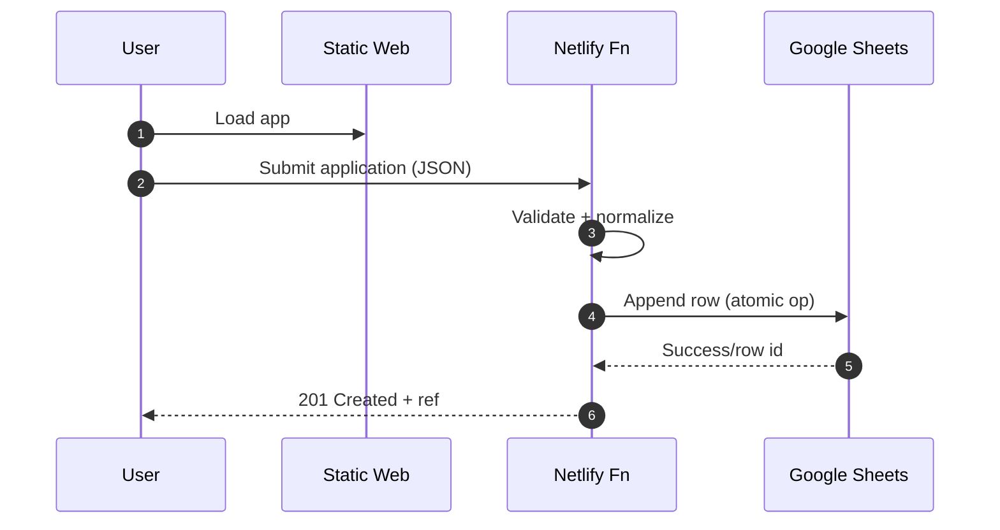
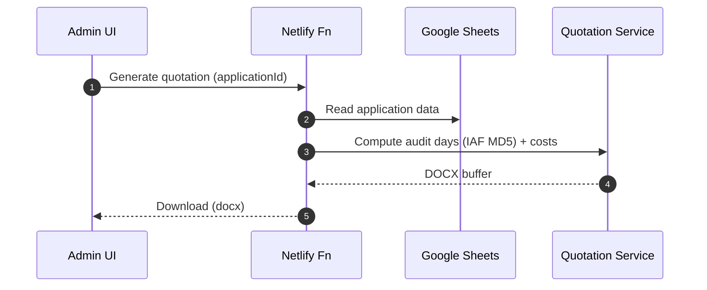
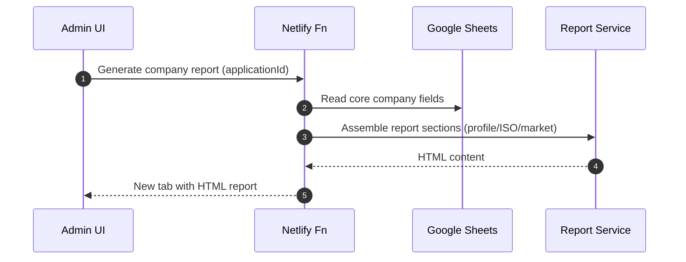
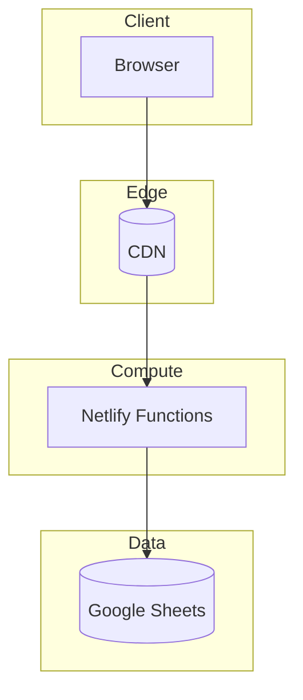

# System Architecture (Deep Dive)

## 1) High-Level Overview
- Frontend: Static web (HTML/CSS/JS), LRQA brand UI, i18n(10 lang), print-optimized
- Backend: Serverless APIs (Netlify Functions), stateless, REST + webhooks
- Data: Google Sheets as operational data hub (submission, admin ops, exports)
- AI: ISO-Guardian chatbot (GPT), RAG with template/IAF MD5 knowledge
- Documents: Quotation (DOCX), Sales Report (HTML/PDF)

```mermaid
flowchart LR
A[Applicant Browser] -- HTTPS --> B[Static Site (CDN)]
B -- XHR/Fetch --> C[Netlify Functions API]
C --> D[Google Sheets]
C --> E[Quotation Generator]
C --> F[Sales Report Generator]
E --> G[DOCX Output]
F --> H[HTML Report]
C --> I[ISO-Guardian AI]
```

## 2) Components & Responsibilities
1. Client Application (Public)
   - Multi-language form, auto-save, chatbot widget, gap analysis entry
2. Admin Dashboard (Auth)
   - Login, search, pagination, status ops, quotation/report triggers
3. Serverless API Layer
   - Input validation, business logic orchestration, rate/cost guard
4. Data Layer (Google Sheets)
   - Single source of truth for submissions; exports/BI compatibility
5. Document Services
   - Quotation (IAF MD5-based audit day and cost calc → DOCX)
   - Sales report (company profile + market/ISO context → HTML/PDF)
6. AI Services
   - ISO-Guardian: multilingual Q&A, context policy/guardrails

## 3) Request Lifecycle (Representative)


### Quotation Generation


### Sales Report Generation


## 4) Failure Modes & Recovery
- API 4xx (validation): 사용자 입력 오류 → UI 표준화된 에러 토스트/필드 포커스
- API 5xx (provider/timeout): 재시도(지수 백오프), 사용자 안내 및 재시도 버튼
- Google Sheets 쓰기 실패: idempotency key로 재시도, 중복 방지
- Document 서비스 실패: 일시적 장애 시 큐 재시도/관리자 재생성
- AI 응답 실패/지연: 폴백 메시지, 제한된 FAQ 캐시 응답

## 5) Scalability & Performance
- 정적 자산: CDN 에지 서빙, 브라우저 캐싱
- 서버리스: 동시성 자동 확장, 콜드스타트 영향 최소화를 위해 핫 경로 경량화
- 캐싱: 파생 데이터(참조코드/리스트) 단기 캐시; 보고서 템플릿 캐시
- 레이트리밋: IP/사용자 별 API 호출 한도, 견적/리포트 생성 쿼터
- 비용 최적화: 고비용(문서/AI) 경로 호출 수 최소화, 배치/비동기화 고려

## 6) Multitenancy & Environments
- Envs: dev / staging / prod (분리된 Netlify 사이트 + 별도 Sheets)
- 테넌시: 단일 테넌트(현 단계). 향후 고객사/리전 단위 테넌트 분리 로드맵
- 구성: 환경 변수(Secrets)로 API 키/시트 ID/템플릿 경로 관리

## 7) Security in Architecture
- 전송: HTTPS/TLS, CORS 정책 최소 허용
- 인증/인가: Admin UI 보호, 역할 기반 액세스(로드맵)
- 입력 보안: 서버측 유효성 검증/정규화, XSS/인젝션 방지
- 비밀관리: 환경변수/빌드 시크릿, 로그 내 민감정보 마스킹
- 개인정보: 최소수집/용도제한, 보존기간 정책, 다운로드 시 경고/워터마크(옵션)

## 8) Observability
- 로깅: API 진입/에러/외부호출 지표, 상관ID(correlation id)
- 메트릭: 호출수, 성공률, p95 응답시간, 문서/AI 호출비용
- 알림: 실패율 상승/타임아웃/쿼터 초과시 알림 훅(Ops 채널)

## 9) Deployment Topology


## 10) CI/CD & Release
- GitHub → Netlify 연동(브랜치/PR 미리보기)
- Build: `pip install -r requirements.txt && mkdocs build` (문서)
- App 배포는 별도(운영 레포)에서 진행. 본 문서는 백서 전용
- 태깅/릴리스 노트: 변경분/아키텍처 결정(ADR) 기록 권장

## 11) API Surface (Sketch)
- POST /api/applications — 제출
- GET /api/applications?query= — 검색/페이지네이션
- POST /api/quotations/:id — DOCX 생성
- GET /api/reports/:id — HTML 보고서 생성
- 레이트리밋 헤더: `X-RateLimit-Remaining`, `Retry-After`

## 12) Data Model Reference
- 필드/스키마는 Appendix → Data Schema 참고 (시트 컬럼 전표준화)

## 13) Roadmap Notes
- Dynamics 365 연동(미도입): 고객/기회 스키마 맵핑, 양방향 동기화 설계 예정
- 역할기반 접근제어, 장기 저장소 분리(OLTP vs. DW), 메시징 큐 도입 검토
