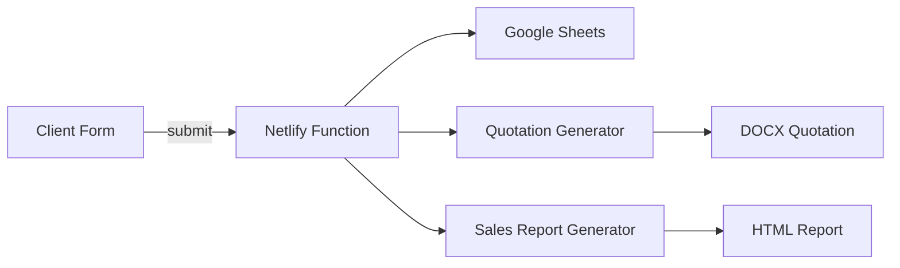

# System Architecture

## High-Level Overview
- Frontend: HTML/CSS/JS (LRQA branding), responsive UI, i18n (10 languages)
- Backend: Serverless functions (Netlify), REST endpoints, webhooks
- Data: Google Sheets as primary data store (synchronization hub)
- AI: GPT-based ISO-Guardian chatbot, RAG for templates/IAF MD5

## Components
1. Client Application (public)
2. Admin Dashboard (authenticated)
3. Netlify Functions API
4. Google Sheets (Data lake)
5. Document Generation (DOCX, HTML, PDF)

## Data Flow

## Availability & Scalability
- CDN edge caching, stateless serverless functions, horizontal scale via provider.
