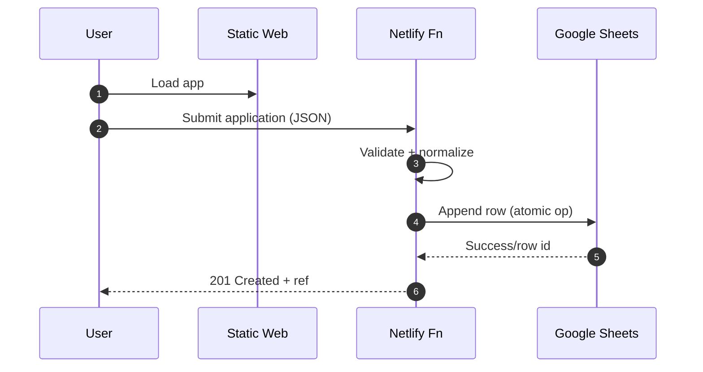
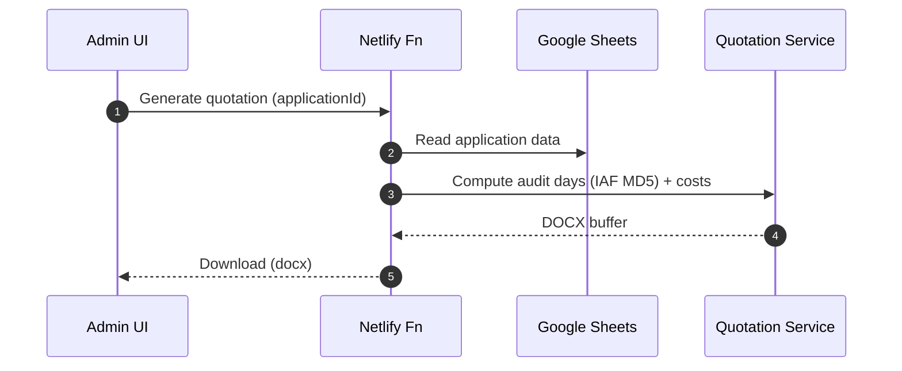
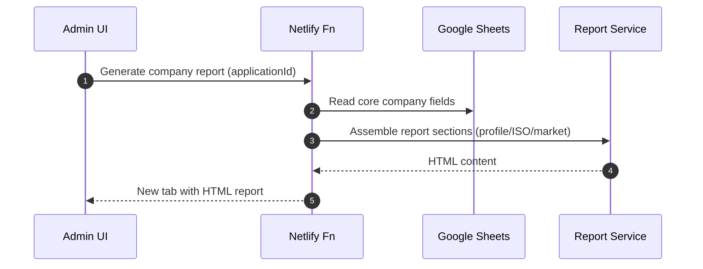
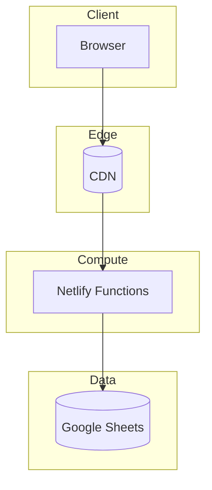

# System Architecture (Deep Dive)

## 1) High-Level Overview
- Frontend: Static web (HTML/CSS/JS), LRQA brand UI, i18n(10 lang), print-optimized
- Backend: Serverless APIs (Netlify Functions), stateless, REST + webhooks
- Data: Google Sheets as operational data hub (submission, admin ops, exports)
- AI: ISO-Guardian chatbot (GPT), RAG with template/IAF MD5 knowledge
- Documents: Quotation (DOCX), Sales Report (HTML/PDF)

```mermaid
flowchart LR
A[Applicant Browser] -- HTTPS --> B[Static Site (CDN)]
B -- XHR/Fetch --> C[Netlify Functions API]
C --> D[Google Sheets]
C --> E[Quotation Generator]
C --> F[Sales Report Generator]
E --> G[DOCX Output]
F --> H[HTML Report]
C --> I[ISO-Guardian AI]
```

## 2) Components & Responsibilities
1. Client Application (Public)
   - Multi-language form, auto-save, chatbot widget, gap analysis entry
2. Admin Dashboard (Auth)
   - Login, search, pagination, status ops, quotation/report triggers
3. Serverless API Layer
   - Input validation, business logic orchestration, rate/cost guard
4. Data Layer (Google Sheets)
   - Single source of truth for submissions; exports/BI compatibility
5. Document Services
   - Quotation (IAF MD5-based audit day and cost calc → DOCX)
   - Sales report (company profile + market/ISO context → HTML/PDF)
6. AI Services
   - ISO-Guardian: multilingual Q&A, context policy/guardrails

## 3) Request Lifecycle (Representative)


### Quotation Generation


### Sales Report Generation


## 4) Failure Modes & Recovery
- API 4xx (validation): input errors → UI toast + field focus
- API 5xx (provider/timeout): retry with backoff; user-facing retry CTA
- Google Sheets write failure: idempotency key retries, dedupe on write
- Document generation failure: queue retry/manual regenerate
- AI failure/latency: fallback message; cached FAQ fallback

## 5) Scalability & Performance
- Static assets: CDN edge, browser caching
- Serverless: auto concurrency scale; keep hot paths lightweight
- Caching: short-lived caches for reference lists/templates
- Rate limit: per-IP/user quotas; generation quotas for costly paths
- Cost: minimize AI/document calls; batch/async where possible

## 6) Multitenancy & Environments
- Environments: dev / staging / prod (separate sites + separate Sheets)
- Tenancy: single-tenant for now; future org/region-level tenancy
- Config: env vars for secrets, sheet ids, template refs

## 7) Security in Architecture
- Transport: HTTPS/TLS, least CORS
- AuthZ/AuthN: Admin protection; RBAC roadmap
- Input: server-side validation/normalization, XSS/injection protection
- Secrets: env vars; mask sensitive data in logs
- Privacy: data minimization; retention policy; optional watermark on downloads

## 8) Observability
- Logging: ingress/error/external-call metrics; correlation id
- Metrics: volume, success rate, p95 latency, doc/AI cost
- Alerts: error-rate/timeout/quota breach notifications

## 9) Deployment Topology


## 10) CI/CD & Release
- GitHub → Netlify integration (branch/PR previews)
- Build: `pip install -r requirements.txt && mkdocs build` (docs)
- App deploy is separate (app repo). This repo is for the whitepaper site.
- Tagging/release notes; record AD decisions (ADR) as needed

## 11) API Surface (Sketch)
- POST /api/applications — create
- GET /api/applications?query= — search/paginate
- POST /api/quotations/:id — DOCX generation
- GET /api/reports/:id — HTML report generation
- Rate-limit headers: `X-RateLimit-Remaining`, `Retry-After`

## 12) Data Model Reference
- See Appendix → Data Schema (Sheets columns standardized)

## 13) Roadmap Notes
- Dynamics 365 integration (not yet implemented): mapping and bi-directional sync design
- RBAC, long-term storage separation (OLTP vs DW), message queue introduction
