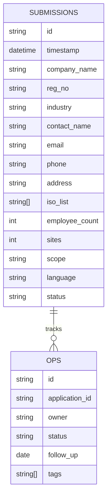
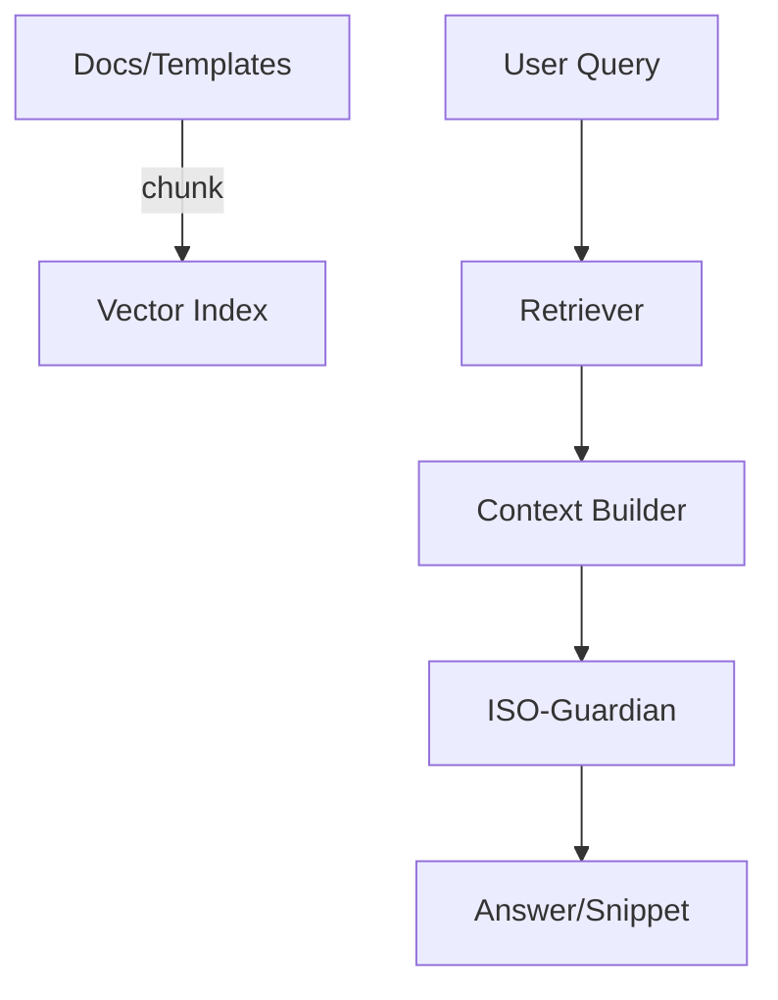

# Data, AI & Security (Deep Dive)

## 1) Data Lifecycle
- Collection: Client form (multi-language), admin edits, system-enriched fields
- Validation: server-side schema validation, normalization (phone/email/locale)
- Storage: Google Sheets (submission tab + reference tabs)
- Processing: quotation/report generation, analytics exports
- Sharing: internal-only; exports via CSV/XLSX/Sheets links
- Retention: configurable by environment; default 12–24 months (GDPR-aligned)
- Deletion: subject-request workflow; soft-delete flag + periodic purge job

```mermaid
flowchart LR
C[Client Form] --> V[Validate & Normalize]
V --> S[(Google Sheets)]
S --> P[Processors (Quotation/Report)]
S --> A[Analytics/Exports]
A --> BI[External BI]
```

## 2) Logical Schema (Sheets)
- Submissions: core application data (company/contact/iso/scope/employees/sites)
- Reference: industries, iso code lists, language map
- Ops: status, owner, follow-up date, notes

| Sheet | Key Columns | Purpose |
|---|---|---|
| submissions | timestamp, company_name, reg_no, industry, contact_name, email, phone, address, iso_list, employee_count, sites, scope, language, status | source of truth |
| ops | application_id, owner, status, follow_up, priority, tags | workflow ops |
| ref_industries | code, name | normalization |
| ref_iso | iso_code, name | validation |

ERD(개념):


## 3) RAG Pipeline for AI
- Knowledge Sources: IAF MD5 parameters, quotation templates, FAQ, policy snippets
- Indexing: section-level chunks with metadata (type, version, locale)
- Retrieval: top-k similarity + rule-based filters (locale/standard)
- Prompt Assembly: system → policy → retrieved → user → tools
- Guardrails: banned topics, PII redaction, length & cost limits



## 4) Prompt Governance
- Templates: versioned prompts per task (faq, gap, quotation-assist)
- Variables: locale, standard, employee bracket, scope keywords
- Policies: safe-completion, refusal cases, escalation phrases
- Observability: prompt+output hashing, sampled reviews, drift watch

## 5) Evaluation (AI & UX)
- Offline: RAG relevance@k, answer faithfulness, toxicity/safety checks
- Online: CSAT, time-to-answer, fallback rate, deflection rate(사람 문의 감소)
- Golden Set: curated Q/A for ISO 9001/14001/45001 + gap scenarios
- Regression: threshold gates in CI before prompt/model upgrades

## 6) Security & Privacy Controls
- Transport: HTTPS/TLS; strict CORS
- Access: admin auth, least privilege on Sheets sharing
- Input Security: server-side validation, escaping, file-type allowlist
- Secrets: environment variables, no secrets in code/logs
- PII: data minimization, masking in logs/exports, retention policy
- DSR: data subject request workflow (export/delete) documented

## 7) Cost/Quota Management (AI)
- Per-action quotas: quotation/report generation daily caps per admin
- Token budget: max tokens per request, truncation policy
- Backoff & Retry: exponential for 429/5xx; circuit breaker on spikes

## 8) Data Quality
- Required field coverage dashboard (Sheets formula)
- Duplicate detection: company+reg_no composite key
- Anomaly rules: out-of-range employee counts, invalid scopes
- Review queue: low-confidence records flagged to admin

## 9) Export & Interop
- Exports: CSV/XLSX/PDF; BI connectors via Sheets
- Downstream: CRM export template; Dynamics 365 mapping (로드맵)

## 10) Checklists
- Privacy
  - [ ] 최소수집, 목적제한, 보존기간 정의
  - [ ] 로그 마스킹, PII 내보내기 통제
  - [ ] DSR 처리 절차(열람/삭제)
- Security
  - [ ] 비밀/키 환경변수화
  - [ ] CORS/입력검증 정책 점검
  - [ ] 권한 공유 범위 최소화(Sheets)
- AI
  - [ ] RAG 소스 최신/버전태깅
  - [ ] 금지주제/민감도 가이드라인 반영
  - [ ] 오프라인/온라인 평가 지표 대시보드화
