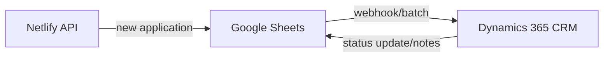

# Integrations & Roadmap (Deep Dive)

## 1) Current Integrations (Implemented)

### a. Google Sheets API (Operational Data Hub)
- New/updated applications → Netlify Functions → Sheets row append/update
- Admin dashboard → Sheets fetch/search → render response

### b. Netlify Functions (API)
- Handles I/O with client/admin, document generation, and sequencing
- Email notifications (optional): notify internal owner on submission

### c. Document Services (Quotation, Sales Report)
- Input (from Sheets) → API → DOCX (quotation) or HTML/PDF (report)
- Admin downloads directly or views in a new browser tab

### d. Newsletter/Marketing Connectors (Basic)
- Newsletter subscriptions → stored in Google Sheets → CSV/API export to Mailchimp/HubSpot (currently manual, automation planned)

## 2) Dynamics 365 Integration Design (Roadmap)

### a. Goals
- Bi-directional sync between application data and CRM (accounts/contacts/opportunities)
- Field mapping, status synchronization, quote/contract workflow linkage

### b. Architecture Flow

### c. Example Field Mapping
| Sheets Field | Dynamics 365 Field | Notes |
|--------------|--------------------|-------|
| company_name | account.name | String match; create if missing |
| contact_name | contact.fullname | Match or create in CRM |
| email | contact.emailaddress | Warn on duplicates |
| iso_list | opportunity.iso_standards | Multi-value mapping |
| status | opportunity.statuscode | Workflow sync |
| quotation_id | quote.quoteid | Sync back after creation |

### d. Triggers & Sync Strategy
- On new/update: Sheets → Dynamics
- On CRM status change (won/lost/approved): Dynamics → Sheets
- Conflict prevention: timestamp/version compare; manual approval path supported
- Security: OAuth, scoped permissions, audit logging of all sync attempts

### e. Error/Version Management
- Queue + retry on API downtime; operator alerts; periodic retries
- Schema changes follow a migration policy and backward-compatibility review

## 3) BI/Marketing/CRM Interop
- BI: Sheets → PowerBI/Tableau (live or scheduled). Optional custom export API/RSS.
- Marketing: Export subscribers to Mailchimp/HubSpot; plan to automate via APIs
- Messaging/Notifications: Webhooks to Slack/MS Teams for approvals/issues

## 4) Additional Roadmap
| Capability | Description | Priority |
|-----------|-------------|----------|
| SSO | SAML/OIDC-based SSO | Mid/Long term |
| External File Storage | AWS S3 / Google Drive integration | Mid/Long term |
| Near Real-time | Webhook-based notifications; optional streaming later | Short → Mid/Long |
| DW/Archive | Sheets → BigQuery/Azure Data Lake archival | Long term |

## 5) Integration Testing & Recovery
- On failure: queue → log → retry with backoff; manual fallback procedure
- Health checks and integration error dashboards for Ops
- Change logs and versioned API/data contracts

## 6) Integration Policy & Ops Standards
- Before changes: staging test, data map/schema update, stakeholder notice
- Document rollback and manual operations for each integration point

---

> Detailed best practices and runbooks can be extended in an appendix if needed.
