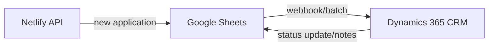

# Integrations & Roadmap (Deep Dive)

## 1) 현재 통합(Implemented)

### a. Google Sheets API (메인 데이터 허브)
- 신규 신청/수정 → Netlify Functions → Sheets Row append/update
- 관리자 대시보드 → Sheets fetch/search → 응답 렌더링

### b. Netlify Functions (API Ep)
- 클라이언트/관리자와 데이터 입출력, 문서 생성, 시퀀스 관리
- 이메일 알림(선택 적용): 신청 시 내부 담당자 알림/지정

### c. 문서 서비스(Quotation, Sales Report)
- 입력 데이터(시트) → API → DOCX(견적) 또는 HTML/PDF(보고서)
- 관리자는 직접 다운로드/새 탭 확인 가능

### d. Newsletter/마케팅 커넥터 (기초 구현)
- Newsletter 구독 정보 → 구글 시트 저장 → CSV/동기식 Export로 Mailchimp/Hubspot 등 마케팅 플랫폼 업로드(현재 수동)

## 2) Dynamics 365 연동 설계(로드맵)

### a. 목표
- 인증신청 데이터와 CRM(고객/회사/기회) 양방향 연결
- 주요 필드 매핑, 상태 동기화, 승인/견적/계약 흐름 연계

### b. 아키텍처 플로우

### c. 데이터 맵 예시
| Sheets Field | Dynamics 365 Field | Notes |
|--------------|-------------------|-------|
| company_name | account.name | 문자열 일치, 신규시 자동생성 |
| contact_name | contact.fullname | CRM 내 existing match or create |
| email | contact.emailaddress | (중복 시 관리자 경고) |
| iso_list | opportunity.iso_standards | 배열/멀티셀형 매핑 |
| status | opportunity.statuscode | 워크플로우 동기화 |
| quotation_id | quote.quoteid | 생성 후 동기화회수 |

### d. 트리거 및 동기화 전략
- 신규/수정 신청시: Sheets → Dynamics 
- CRM에서 승인/포기/계약 상태 변경시: Dynamics → Sheets(상태 동기화)
- 충돌 방지: timestamp/version 비교, 수동 승인 루틴 지원
- 보안: OAuth 인증, API Key/권한분리, 감시 로깅(연동 성공/실패 리포트)

### e. 오류/버전 관리
- API 오프라인/실패시 큐잉, 알림(Ops, 관리자), 일정 주기 재시도
- 필드 변경/스키마 업그레이드시 마이그레이션 정책 명시

## 3) 외부 BI/마케팅/CRM 연계 구조
- BI: Google Sheets→PowerBI/Tableau 등 외부 BI 툴 실시간/주기적 연동 (필요시 전용 export API/RSS 지원 가능/로드맵)
- 마케팅: 시트의 구독 데이터 주기적 export → Mailchimp/HubSpot API 연동 계획(자동화 목표)
- 실시간 메시징/알림: Webhook, Slack/MS Teams 통합, 업무 자동화(승인알림, 이슈 트래킹 등)

## 4) 추가 확장 로드맵
| 확장 항목 | 설명 | 우선순위 |
|-----------|------|----------|
| SSO | 자체/조직 SSO(SAML/OIDC) 연동 | 중/장기 |
| 외부 File 저장 | AWS S3, Google Drive 파일 연계 | 중장기 |
| 실시간(스트리밍) | 메시징, webhook 기반 실시간 통지 | 최소한 단건 알림 단기 -> 실시간 병렬화는 중/장기 |
| DW/아카이브 | Sheets→BigQuery, Azure Data Lake 등 장기 저장소/아카이브 | 장기 |

## 5) 테스트 & 복구(연계)
- 연계 장애시: 큐잉→로그→재시도(백오프/수동작업 fallback)
- 정기 Health Check, 통합 로그/에러 대시보드(Ops)
- Change Log/버전 정책, API/데이터 계약 문서화

## 6) 통합 정책 & 운영 표준
- 변경 시 운영 대응 체크리스트: 사전 테스트/협의, 데이터 맵/스키마 문서화, 사용자 통보
- 각 연계 포인트 롤백/수동 운영 플로우 문서화

---

> 향후 통합/운영 표준 등 상세 Best Practice/운영런북은 별도 appendix로 확장 가능
